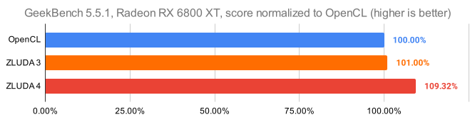
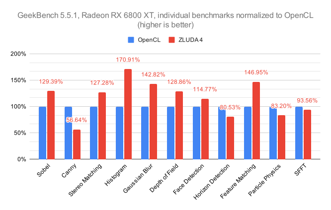

+++
title = "ZLUDA update Q4 2024"
date = 2024-12-31
+++

Hello everyone, it's the first of many ZLUDA updates. I've been working hard and I'm happy to announce that we reached the first milestone: we have a new version of ZLUDA with an actual working application. ZLUDA can run Geekbench 5.

This update also includes a few words on how to contribute ([Contributing to ZLUDA](#contributing-to-zluda)) and changes in the internals of the "new" ZLUDA ([New parser](#new-parser), [Atomics modulo](#atomics-modulo)).

### Geekbench 5

While Geekbench is far from being the most requested application, it's important for ZLUDA's development: 

* It uses a relatively small CUDA API surface, which makes it easy for ZLUDA to support (at least easy when compared to Blender or PyTorch).
* It's closed-source, so it's not possible to port it to HIP (via HIPIFY or other means).
* It has both a generic OpenCL backend and an NVIDIA-specific CUDA backend, so we can measure the performance gain when using ZLUDA.

The "old" ZLUDA was about 1% faster than the native OpenCL. I was worried that the fresh new code would be slow, but the "new" ZLUDA turned out to be even better than the "old" one and is approximately 10% faster than the native OpenCL. Note that <u>this performance improvement is Geekbench specific and not generalizable</u>. Still, I'm happy with how things turned out. If you are interested in the technical details read the [Atomics modulo](#atomics-modulo) section down below.

(The graphs below show slightly inconsistent results because the top graph uses previously collected numbers for OpenCL and ZLUDA 3, the bottom graph uses freshly collected numbers for OpenCL)

Next on the roadmap is llm.c.




 
### Contributing to ZLUDA

I regularly get questions about how to contribute to ZLUDA, here's how (this information is now also in the project's README):

ZLUDA project has a commercial backing and does not accept donations.
ZLUDA project accepts pull requests and other non-monetary contributions.

If you want to contribute a code fix or documentation update feel free to open a Pull Request.

There's no architecture document (yet). Two most important crates in ZLUDA are `ptx` (PTX compiler) and `zluda` (AMD GPU runtime). A good starting point to tinkering the project is to run one of the ptx unit tests under a debugger and understand what it is doing. `cargo test -p ptx -- ::add_hip` is a simple test that adds two numbers.

Github issues tagged with ["help wanted"](https://github.com/vosen/ZLUDA/issues?q=is%3Aissue+is%3Aopen+label%3A%22help+wanted%22) are tasks that are self-containted. Their level of difficulty varies, they are not always good beginner tasks, but they defined unambiguously.

If you have questions feel free to ask on [#devtalk channel on Discord](https://discord.com/channels/1273316903783497778/1303329281409159270).


### New parser

This is the first time I've written an extensive write-up about an issue like this and I'm curious to know what do you think. Is this too detailed? Not detailed enough? Should all issues be broken down like this? Leave a comment.

[Commit 193eb29](https://github.com/vosen/ZLUDA/commit/193eb29) finally brought a major feature that solves one of the least visible and hardest to fix problems in ZLUDA. 

First, you need to understand what PTX is. PTX is the NVIDIA GPU intermediate language. Intermediate languages work like this: 
* Programmer writes source code
* Programmer compiles their source code into an intermediate language X and sends it to the user
* User runs the application. At some point, the intermediate code X is compiled (finalized) into binary for his particular hardware

Intermediate languages are a fairly common solution: Java has JVM bytecode .NET has CIL, gaming GPUs have SPIR-V, LLVM has LLVM IR. They all solve slightly different problems, but in the GPU context they are used to to avoid the forward compatibility problem. That's why GPU code written ten years ago works just fine on modern GPUs even though your GPU vendor has made major changes to his GPU architecture.

What if your software stack does not have an intermediate language? Then either:
* You declare your hardware to be strictly forward-compatible. All changes are strictly additive: code compiled for older hardware will work on the newer hardware, but will not be able to take advantage of the hardware features. This is what the x86 CPU family does
* You simply ignore the forward compatibility and compile from scratch for each new hardware target. This is the AMD GPU way 

The CUDA driver ships with a compiler that compiles (finalizes) from PTX to the particular NVIDIA GPU architecture and of course ZLUDA does the same, but for AMD GPUs.

The compilation itself is divided into several steps and the first step is parsing: converting from textual representation (PTX is a text format) to in-memory representation.

PTX, being a language, follows certain grammatical rules. For example, this line:
```
ld.global.cs.b32  r1, [addr1];
```

means "load (`ld`) from global address space (`.global`) with streaming cache behavior (`cs`) 32-bit integer (`.b32`) into variable `r1` from address stored in variable `addr1`". You don't need to understand what all this means, just that there is an order to words in an instruction: operand, operands, registers. If the same instruction were written this way, it would violate grammar rules and result in an error:
```
ld r1, [addr1] .global.cs.b32;
```

Writing a PTX parser is not hard. As long as you are familiar with a parser generator you can get a high quality parser working relatively quickly and painlessly. ZLUDA used [lalrpop](https://github.com/lalrpop/lalrpop) for this task

It turns out that there is an important undocumented "feature" of the PTX language. Although the documentation lays out a certain language grammar and the NVIDIA PTX-generating compiler follows it, the NVIDIA PTX-consuming (finalizing) compiler is more permissive. NVIDIA PTX-consuming (fnalizing) compiler allows some (but not all) words in an instruction to be passed out-of-order, so both `ld.global.cs.b32  r1, [addr1];` and `ld.cs.global.b32  r1, [addr1];` are accepted. For 99.99% of the code out there, it's not a problem: the compiler will correctly generate all the instructions in the documented form. The problem is "inline assembly". The CUDA the programming language (dialect of C++) allows programmers to write PTX instructions directly. And programmers get the PTX grammar wrong all the time. NVIDIA's PTX parser is tolerant of the mistakes, but ZLUDA's old parser was strict and was special cased for every new project that got its PTX instructions out-of-order.

ZLUDA's parser is strict because we want to have a strongly-typed representation of instructions as soon as possible and carry the same representation through all stages of compilation. Strongly-typed means that invalid combinations of operands are not only rejected by the parser but impossible to even express in the code.

I can only speculate about NVIDIA's PTX parser, but its tolerance for out-of-order operands is probably an artifact of a more weakly typed internal representation or a two-stage parsing strategy (first do a simple parse to a weakly-typed representation and then validate and convert weakly-typed to strongly-typed).

Back to ZLUDA's parser: it's easy enough to support the previous example: just have one rule for `ld.<address_space>.<cache_hint>.<type>` and one for `ld.<cache_hint>.<address_space>.<type>`. The problem is that ld operation can be very long. Its full form is:
```
ld{.weak}{.ss}{.cop}{.level::cache_hint}{.level::prefetch_size}{.vec}.type
```

With 5 possible operands (`ld` is always at the start, `.vec` and `.type` are always at the end), there are up to 120 separate rules. And this does not even take into account optionality (every segment  in `{` `}` brackets is optional).

"Out-of-orderness" is difficult to express well in a lalrpop-style parser (very few grammars want this "feature"). I replaced our old parser with the one based on [winnow](https://github.com/winnow-rs/winnow). Since ZLUDA tries to be strongly-typed this had a knock-on changes across all the compiler passes. But we now support all the broken PTX in the wild (which funnily enough comes mostly from NVIDIA's own libraries).

### Atomics modulo

NVIDIA hardware supports a weird little atomic modulo increment/decrement instruction (`atom.inc`/`atom.dec`) with semantics like this:
```
unsigned atomic_inc(unsigned volatile* p, unsigned modulo) {
  unsigned result;
  atomic {
    result = *p;
    *p = (result >= modulo) ? 0 : result+1;
  }
  return result;
}
```

For the longest time, I simply did not realize that AMD hardware natively supports this instruction and ZLUDA emulated it with a `cmpxchg` loop. Now that it is natively supported in ZLUDA, code using it is much faster. Unfortunately, other than GeekBench, there really aren't that many users of this instruction, so it won't have much performance impact overall.

To my knowledge, this instruction is not commonly available on CPUs. Do you know of any algorithms or data structures that benefit from this instruction? If so, let us know in the comments, I've been wondering about this for a few years now.

### Bonus content: interview
I was interviewed about ZLUDA for Youtube channel "Tech over Tea". Watch it [here](https://www.youtube.com/watch?v=ze25Sie2gVQ).