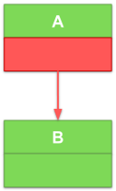
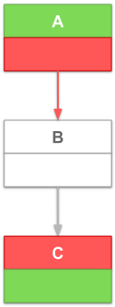
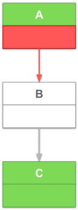
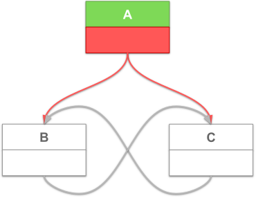

+++
title = "ZLUDA update Q1 2025 - roadmap update, LLVM tests, denormals"
date = 2025-04-03
+++

Welcome to the new ZLUDA update. Read about our plans for the nearest future (that include PyTorch and PhysX) in [Roadmap update](#roadmap-update) and about progress made this quarter in [LLVM bitcode unit tests](#llvm-bitcode-unit-tests) and [Correct rounding and denormal modes on AMD GPUs](#correct-rounding-and-denormal-modes-on-amd-gpus).

### Roadmap update

#### PyTorch

PyTorch remains my top priority and I still aim at being able to have PyTorch running on ZLUDA Q3/Q4 this year. Before PyTorch is up and running I am aiming for an intermediate goal: llm.c. You can see the progress towards getting llm.c up and running [here](https://github.com/vosen/ZLUDA/milestone/5).

#### PhysX

As you might have read [here](https://www.techpowerup.com/332763/nvidias-32-bit-physx-waves-goodbye-with-geforce-rtx-50-series-ending-32-bit-cuda-software-support), [here](https://www.tomshardware.com/pc-components/gpus/physx-quietly-retired-on-rtx-50-series-gpus-nvidia-ends-32-bit-cuda-app-support) and on multiple other sites, NVIDIA dropped support for 32-bit PhysX in their latest generation of GPUs, leaving a number of older games stranded.

This reignited the debate about [ZLUDA’s PhysX support](https://github.com/vosen/ZLUDA/discussions/31). After reading through it several times, it’s clear to me that there is a path in ZLUDA to rescuing those games and getting them to run on both AMD and NVIDIA GPUs.

I broke down the implementation into tasks [here](https://github.com/vosen/ZLUDA/milestone/6). If you can program Rust and want to make a lot of people happy, I encourage you to contribute. I won't be able to work on it myself because I'll be busy with PyTorch support, but I'll help in any way I can.

### LLVM bitcode unit tests

The ZLUDA compiler is the cornerstone of the project. It processes PTX modules by applying a series of transformations, ultimately generating LLVM bitcode. This LLVM bitcode is subsequently fed into the installed ROCm/HIP driver, which compiles it into a binary suitable for the currently installed GPU.

The compiler codebase includes multiple unit tests. Each test asserts that for:
* given PTX source code
* given input data
* given output data

It can compile successfully and execute compiled binary with input data and produce the output data.

While this covers the entire end-to-end flow, there is a valuable sub-flow hiding here that could be tested too: the compilation from PTX to the LLVM bitcode. For each PTX source module, we could commit the compiled LLVM bitcode in a textual format and implement tests to ensure it remains unchanged. This approach is particularly useful for newly written complex compiler transformations that modify the emitted LLVM across the board. By using LLVM bitcode tests, you can observe how your modifications impact LLVM generation across various use cases, even those you might assume are unrelated.

This feature sat on the "help wanted" list for quite some time and I’m happy to see the first external contributor address this issue. JoelleJS merged it in [#324](https://github.com/vosen/ZLUDA/pull/324). Just in time for a significant feature that will use these tests.

### Correct rounding and denormal modes on AMD GPUs

This is an important feature that I have wanted to do for years. It is not present even in the old (pre-rollback) ZLUDA. The priority was always given to enabling new workloads, instead of making everything perfectly correct. Now we are out of proof-of-concept mode and can spend some time on correctness. As you will read below, it is a complex feature that is quite often invisible to the end user. It was acceptable for old ZLUDA do things incorrectly.

> **Warning**  
The remainder of this article assumes you know what PTX, floating-point numbers, control flow graphs, and basic blocks are. You don't need to be an expert, but a lack of familiarity with these concept will make everything below incomprehensible.

If you know what floating-point denormals and rounding modes are you can skip to the next section ([Previously on "ZLUDA" ...](#previously-on-zluda)).

First, some definitions. What exactly is denormal mode, and what are denormal numbers? Denormals (subnormals), represent a category of very small floating-point values. For the most common floating point size (32 bit), these values fall within the range of -3.4×1038 to 3.4×1038 (excluding 0). Due to the encoding of floating-point numbers, this category necessitates additional processing and has historically been either unsupported or supported with reduced performance. When we say "unsupported," it means that denormal values are treated as zeros. In the context of PTX, denormal mode refers to a flag (`.ftz`) on floating-point instructions that determines whether they process denormal values or treat them as zeros, "flushing to zero." In general, modern, mainstream hardware architectures can handle basic operations - add, multiply, fused multiply add, etc. - with denormal values at full speed.

Now rounding mode. Most of the "simple" operations floating-point operations are formally defined as "performs the operation with infinite precision and then rounds infinite value to a finite value using chosen mode". Usual rounding modes are "round to nearest even", "round to zero", "round to positive infinity", "round to negative infinity". Rounding mode effectively controls the least-significant bit of the mantissa of the floating-point result. Although a single least-significant bit may seem insignificant, it can have a noticeable impact. For instance, consider two values that differ only by the least significant bit: 1.0000000 and 1.0000001. In certain contexts, the difference of 0.0000001 can be substantial.

Now that we understand the denormal and rounding part, let's focus on the mode part. Typically, CPUs will do some mix of integer calculations and floating-point calculations, with the specific proportions varying based on the workload. In contrast, GPUs—regardless of whether they are tailored for gaming, high-performance computing (HPC), or machine learning—primarily dedicate their processing cycles to floating-point operations. This focus prompts GPU architects to prioritise floating-point support in their hardware designs.

One notable feature found in NVIDIA hardware, and consequently in PTX, is the per-instruction control for denormal and rounding operations. In a CPU, a common approach to managing this issue is to implement a global control (as seen in x86 and ARM architectures) or to forgo denormal control altogether (as in RISC-V). While this design choice is beneficial for programmers, it presents unique challenges for ZLUDA when translating to an AMD GPU which uses global control (like a CPU).

#### Previously on "ZLUDA" ...

Pre-rollback ZLUDA used the simplest possible approach that almost works:
* For denormal mode (which is either "flush-to-zero" or "preserve denormals") hold a "vote" for each function. Count the number of instructions using each mode and then just use the more prolific mode across the function
* For rounding mode, ignore it completely and always use "round to nearest even"

PTX module compiled from C++ CUDA sources will usually use the same denormal mode across the whole module with particular mode depending on the compiler flags. Rounding mode use is somewhat uncommon.

Sure, this approach is not correct, but it worked somewhat okayish and it led to only a single major bug (that I’ve noticed). Still, ZLUDA is now out of proof-of-concept mode and we are now doing things correctly.

#### Dead end#1: LLVM & HIP/ROCm

When implementing a new compiler feature in ZLUDA, the first step is to check if it's implemented by the baseline LLVM. The perfect LLVM support would allow ZLUDA to do a trivial per-instruction transformation like this:

from (PTX pseudocode):
```
z = add.ftz x, y
a = add.ftz b, c
```
to (LLVM pseduocode):
```
old_fpstate1 = llvm.get_fpstate()
llvm.set_ftz(true)
z = add x, y
llvm.set_fpstate(old_fpstate1)
old_fpstate2 = llvm.get_fpstate()
llvm.set_ftz(true)
a = add b, c
llvm.set_fpstate(old_fpstate2)
```
and have LLVM optimize that to (AMD GPU assembler pseudocode):
```
S_DENORM_MODE flush, flush
V_ADD_NC_U32 z, x, y
V_ADD_NC_U32 a, b, c
```
The initial research on LLVM floating point builtins appeared promising, as this collection of intrinsics seemed to address our specific use case:
* `llvm.get.fpenv/llvm.set.fpenv`
* `llvm.get.fpmode/llvm.set.fpmode`
* `llvm.experimental.*` family

Sadly, they are all deficient in some way. They either compile down to poor, unoptimized AMD GPU code or do not work at all . Granted, `llvm.experimental.*` support is being worked on by AMD and should appear in the future ROCm versions, but this does not help us today.

This raises the question: in CUDA C++ you have a bunch of builtins to do operations with the specified rounding mode, e.g. `__fadd_rz` for floating point addition with "round-to-zero" mode. What happens on ROCm?

Further exploration revealed ([source](https://rocm.docs.amd.com/projects/HIP/en/latest/reference/math_api.html#floating-point-intrinsics)):
> Only the nearest-even rounding mode is supported by default on AMD GPUs. The `_rz`, `_ru`, and `_rd` suffixed intrinsic functions exist in the HIP AMD backend if the `OCML_BASIC_ROUNDED_OPERATIONS` macro is defined.

Ok. You can use those functions, but they are hidden behind a define. That’s weird. Time to try it!

The HIP/ROCm source code:
```
#include <hip/hip_runtime.h>

__global__ void foobar(int* array, int n) {
    int tid = blockDim.x * blockIdx.x + threadIdx.x;
    array[tid] = __fadd_rz(array[tid], array[tid]);
    array[tid+1] = __fadd_rz(array[tid+1], array[tid+1]);
}
```
When using ROCm 6.3, compiles down to this (some output omitted for clarity):
```
0000000000001900 <__ocml_add_rtz_f32>:
        s_waitcnt vmcnt(0) expcnt(0) lgkmcnt(0)
        s_setreg_imm32_b32 hwreg(HW_REG_MODE, 0, 2), 3
        v_add_f32_e32 v0, v0, v1
        s_setreg_imm32_b32 hwreg(HW_REG_MODE, 0, 2), 0
        s_setpc_b64 s[30:31]

...

0000000000001a00 <_Z6foobarPii>:
        ...
        s_getpc_b64 s[0:1]
        s_add_u32 s0, s0, 0xfffffeac
        s_addc_u32 s1, s1, -1
        ...
        s_swappc_b64 s[30:31], s[0:1]
        v_cvt_f32_i32_e32 v1, v5
        v_cvt_i32_f32_e32 v4, v0
        v_mov_b32_e32 v0, v1
        s_swappc_b64 s[30:31], s[0:1]
        s_delay_alu instid0(VALU_DEP_1)
        v_cvt_i32_f32_e32 v5, v0
        global_store_b64 v[2:3], v[4:5], off
        s_endpgm
```
Ok, mystery solved. I too, would like to hide this compiler output.

For those of us who are not proficient in AMD GPU assembly: every use of `__fadd_rz` requires a function call (`s_swappc_b64`, expensive) and two calls to set rounding mode (`s_setreg_imm32_b32`, also expensive). This is simply too much overhead to be acceptable. 

We are going to build our own support. Our goal, for the code above, is a single instruction to set the rounding mode (or even zero instructions as we will see later).

#### Building support in ZLUDA

Our new goal is to write a complete transformation (compiler pass) in ZLUDA that will insert instructions that set the global modes (rounding and denormal). We want to insert as few instructions as possible for the best possible performance - there’s no LLVM pass that is going to optimize the insertions for us.

Let’s take half of a step back. We know that the trivial (and slow) approach is to simply set the global mode before every instruction that makes use of a mode. It can be improved by omitting the mode-setting instructions if we know that the previous instruction uses the same mode. We can always track this in straight-line code, but what happens if there are branches? What happens if there are multiple branches with from different sources, but into the same target? It seems to be sufficient to figure out which branches require mode change and which do not.

This leads us to a new reformulation. We can express this problem as a control flow graph augmented with a little bit of extra information: for each mode (denormal, rounding) each node (basic block) will have "entry" state and "exit" state. Entry state for a basic block is the mode of the first mode-using instruction in the basic block. Similarly, exit mode is the mode of the last mode-using instruction. This simplifies problem quite a bit. We must now compute which edges (jumps) in the control flow graph require an insertion of mode change.

For illustrative purpose we will only consider mode that takes two values: true (green) and false (red). Picture below is node "A" that has a "true" entry mode and "false" exit mode and jumps to node B that has "true" entry mode and "false" exit mode:


<p align="center">

</p>

#### Dead end #2: mode forward propagation

Something I did not mention explicitly, but is important: some nodes lack both entry and exit modes. Consider the following example:

<p align="center">

</p>

There’s no need to enter mode-setting instruction - node B will propagate the "false" value, but in this example:

<p align="center">

</p>

we need to insert mode change from "false" to "true" somewhere between nodes A and C.

My first instinct was to propagate modes forward: for each node propagate its exit mode to all its successor nodes. While it is instinctively correct and solves two examples above, there are two problems:

* It’s relatively awakward to implement. Remember, a node can have more than one predecessor nodes. What happens if there is a node with an empty incoming edge and a "true" incoming edge? Should we do post-processing?

* More concretely, this does not really handle codependence patterns like this:  
  <p align="center"></p>
  In this example node A can’t propagate its mode to B or C outright because they have more incoming edges. B and C can’t propagate their mode either because they have no mode - they depend on A.
  
#### Better approach: backward propagation

Dependency problems from the previous solution hint at a better approach: backward propagation. Instead of propagating the exit mode we can compute the set of incoming modes. This set is the set of all possible values a given mode can have on the first instruction of the basic block. Sounds complex, but can be computed easily if you have our augmented control flow graph. Take all incoming nodes and if an incoming node’s exit mode is non-empty then add that value to the set, if the incoming node’s exit mode is empty then recursively check its incoming nodes.

We now have the core of our algorithm, but it’s not a complete solution yet: the realities of AMD GPU hardware make it far more complex.

#### Hardware quirks

When targeting AMD GPUs, there are several hardware properties that we should take into account:

* Kernel, on startup, has a certain initial state that is controlled by the programmer (or the compiler in our case). Part of the initial state is the initial state of denormal and rounding registers (global modes). We get this initial mode for free, no extra instructions needed

* Each mode (denormal and rounding) is actually split into two registers (global modes). One for f32 and one for joint f16 and f64. In total there are four registers: denormal f32, denormal f16+f64, rounding f32, rounding f16+f64

Registers (global modes) of the same kind (denormal, rounding), but with different width (f32, f16+f64) are for our purpose twin registers. One quirk of AMD GPU is that there are three instructions for settings global mode: `S_SETREG` to set any hardware (non-generic purpose) register and `S_ROUND_MODE`, `S_DENORM_MODE` to set just the rounding or denormal mode. `S_ROUND_MODE`, `S_DENORM_MODE` are much cheaper than `S_SETREG`. The annoying limitation of `S_ROUND_MODE`, `S_DENORM_MODE` is that they can only set both f32 and f16+f64. For this reason we will only do mode insertions for both f32 and f16+f64

#### Final algorithm

If you made it this far, congratulations, you made it through the introduction. Now we can start implementing our algorithm.

##### Create control flow graph

Our first step is to compute the control flow graph. Every basic block contains entry and exit mode. For efficiency each node actually contains four entry modes and four exit modes. One for each AMD GPU mode: denormal f32, denormal f16+f64, rounding f32, rounding f16+f64.

We handle function calls by including them in the graph. Call from function "foo" to function "bar" is expressed as a node from the caling basic block of "foo" to the first basic block of "bar". We don’t support virtual calls in the current ZLUDA, because they are extremally rare. They can be easily added later.

During this step we compute both entry and exit mode for each basic block. Additionally, each kernel starts with an artificial starting node. This node get a special "entry" and "exit" value: the numeric identifier of the kernel. This numeric identifier is used across the whole ZLUDA compiler. It is already present (generated by previous compiler passes) and unique for a kernel. For example: while denormals register can take one of two values: true or false, in our CFG, the values that represent denormals can be true, false or arbitrary numeric id of a kernel. While going from a bounded to an ubounded set does not intuitively sound like a good decision, it’s temporary. We will optimize it back to the bounded set soon.


##### Compute minimal insertions

Our next goal is, for each of the four modes, compute minimal set of insertions. In other words: figure out which basic blocks can be reached with different mode than expected by the first instruction. We do this computation for each of the four modes separately.

We start by computing two sets: required insertions and potential insertions. We choose nodes which have an entry mode (we skip the nodes with empty entry mode and kernel nodes with numeric ids). Then, for each node, we compute the set of incoming modes:
* If the set contains a value that is different from the node’s entry mode then we add the node to required insertions
* If the set of incoming modes is purely a set of kernel numeric ids (with no conflicting specific mode values) then we add the node id along with its mode and kernel ids to the potential insertions

Required insertions are set in stone: if we jump from another node with different mode then we must insert a mode set instruction. Potential insertions on the other hand can be omitted: for a given node, if all the related kernels have the same initial value as the node then we can skip the mode set instruction.

E.g. if we have kernels "foo" and "bar" that both call function "asdf" and "asdf" entry mode is "true", then we should set initial mode for "foo" and "bar" to "true" and avoid inserting additional mode-setting instructions.


The problem is easy to solve in the example above, the general case is not trivial. I could not come up with a non-brute force algorithm and opted to encode the problem as an integer linear programming problem and use an external solver. [This excellent post](https://cs.stackexchange.com/questions/12102/express-boolean-logic-operations-in-zero-one-integer-linear-programming-ilp/12118#12118) helped encode my constraints. As for the solver I went with [microlp](https://github.com/Specy/microlp), mainly because it’s a relatively small dependency. I wanted to avoid dragging something big like SCIP or even Z3 into the project. Our problem sizes are not going to be big. PTX modules tend to have a handful of kernels and simple control flow.


#####  Compute full insertions

Now we have:
* Provisional control flow graph (with some nodes empty and kernel starting nodes containing numeric ids instead of specific values)
* List of nodes that require a mode change on entry (if the incoming mode is different - there might be multiple nodes incoming, each with their own mode)
* For kernels that were subject to optimization in the previous step: its initial state

We are almost ready to start inserting `S_ROUND_MODE` and `S_DENORM_MODE`. We have all the necessary information, we just need to do some more preprocessing. Specifically we need to know two things:

* What is the effective entry mode for each block  
  Note that even though mode instructions are inserted along edges in the CFG (jumps in code), we don’t explictly store edges. That’s because when inserting mode-setting instructions in a basic blocks we will implictly calculate exit mode anyway. And since we know what identifier we jump into, as long as we have information what are the modes of our jump target we know if they are different and in consequence if the jump requires a mode change

* What is the exit mode for a function  
  This is necessary because functions calls are mechanically different from normal jumps. Function calls terminate a basic block and we need to know if the new basic block starting from the first post-call instruction requires a mode change. Since a function can be called from many places it is a responsibility of the caller to do post-call mode adjustments (if necessary)

Computing both of those is relatively straightforward. First, we take our incomplete control flow graph and resolve all empty nodes and special kernel nodes. For empty nodes we compute the incoming set - if the set contains more than a single value, we use a special value "conflict". For special starting kernel nodes we have a list of kernel with their initial values from the previous optimization pass.

Lastly, we join four separate logical CFGs (each for one AMD GPU mode) into two lookup tables. One lookup table contains all the necessary information to support mode changes for branches, the other lookup table contains all the necessary information to support mode changes for functions calls.

##### Apply mode control

In this stage we walk through every function (kernel and non-kernel) and modify it accordingly:
* If necessary, insert mode change "prelude" basic block before each basic block
* If necessary, redirect branch to go into mode change "prelude"
* Insert all mode changes inside a basic block. We fold twin registers together. For example pseudocode like this:
  ```
  add.ftz.f32 a, b, c;
  add.no_ftz.f16 x, y, z;
  ```
  gets converted into this pseudocode:
  ```
  set_denormal.f32.f16 ftz, no_ftz;
  add.f32 a, b, c;
  add.f16 x, y, z;
  ```
After all this hard work we now get a new module with a small number of freshly inserted mode change instructions. It’s not optimal in the absolute sense, but it’s much better than the alternatives. The AMD GPU code is now as correct as we can make it. Unfortunately, after all this hard work, our code can still miscompute some code. Read below for more.

#### LLVM sadness

Sadly, there are still some issues outside of our control.

Firstly, a minor issue. As mentioned previously, for each AMD GPU kernel we can sat initial denormal mode and initial rounding mode. This is true in the general sense, but for some reason LLVM AMDGPU backend exposes the control for initial denormal mode, but not for initial rounding mode. Right now, we set initial rounding mode by inserting the instruction for it at the start of the kernel. We could skip this single instruction with better LLVM AMD GPU support.

Secondly, a bigger issue. Hardware-agnostic LLVM passes don’t understand AMD GPU instructions that set global state. So this pseudocode:
```
set_denormal.f32.f16 ftz, ftz;
add.f32 x, b, c;
set_denormal.f32.f16 no_ftz, no_ftz;
add.f32 y, b, c;
```
after LLVM optimizations ends up as:
```
set_denormal.f32.f16 ftz, ftz;
add.f32 x, b, c;
mov.f32 y, x;
```
Which gives incorrect result. While it’s rare to see the same input being computed twice with different modes, it’s concerning.

Fixing this would require deeper changes in LLVM (making mode part of the instruction, like in llvm.experimental.constrained.*) and probably porting this pass to LLVM. We might do eventually do it, but that’s enough effort for now.

---

If you made it this far, let me know in the comments what do you think. See you next time.