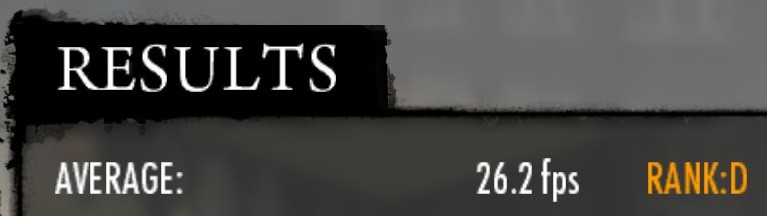
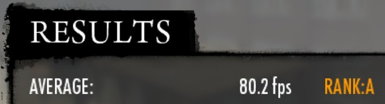

+++
title = "ZLUDA update Q1&Q2 2026 - back to the roots"
date = 2026-06-29
+++

Hi, and welcome to the latest ZLUDA update! Since I skipped the last update, this special issue covers all the developments made in ZLUDA since the start of the year. We now have two new major workloads: PhysX ([PhysX pre-alpha](#physx-pre-alpha)) and Blender ([Textures support](#textures-support)). Much of this overlaps with [Much improved Windows support](#much-improved-windows-support). Additionally, there has been a steady stream of minor features and improvements to existing workloads ([Better ML support](#better-ml-support)). These culminated in a new major release ([Version 6](#version-6)). Some of you may also be interested in the [The new direction of the project](#the-new-direction-of-the-project).

### Version 6
I am finally marking a new major release. As a remainder, ZLUDA follows a continuous development model. A major release does not represent addition of any particular single feature a compatibility break, but rather signals that significant progress has been made and that it is worth trying it out again. Version 6 is identical to the latest preview build (6-preview.79).

### PhysX pre-alpha
With PC component prices as high as they are, we're all being compelled to revisit gaming classics.  
ZLUDA has got you covered.  
This long-running PR ([#651](https://github.com/vosen/ZLUDA/pull/651)) is not yet comlete, but it adds support for 32-bit PhysX. This means that, in certain older games that relied on PhysX, you will be able to achieve a higher frame rate with an AMD GPU. In some games, AMD GPU owners will also be able to enjoy additional visual effects such as debris and flame for the first time.

Various PhysX samples running on an AMD GPU:

<video width="512" height="512" controls autoplay loop>
  <source src="flag_sample.mp4" type="video/mp4">
</video>
<video width="512" height="512" controls autoplay loop>
  <source src="cow_sample.mp4" type="video/mp4">
</video>
<video width="800" height="600" controls autoplay loop>
  <source src="frog_sample.mp4" type="video/mp4">
</video>

Even more interestingly, here's a screenshot from Mafia II (original 2010 version) built-in benchmark  running on an AMD GPU. All settings are maxed out and PhysX is enabled:

 **ZLUDA OFF** (click image to view the full screen)

 **ZLUDA ON** (click image to view the full screen)

Support is not yet complete: fluid simulations can be glitchy, and the current method of loading ZLUDA into Steam games is poor. I only tried it on my own PC, which has an unusual GPU setup. Nevertheless, if you are comfortable with editing the source code and building ZLUDA yourself, you can give it a try. For everyone else, I recommend watching the PR and waiting for it to be merged and included in the preview builds. Plese leave your feedback in the PR or on Discord.

PCGamingWiki maintains a [list of PhysX games](https://www.pcgamingwiki.com/wiki/List_of_games_that_support_Nvidia_PhysX). Just be aware that the list combines 32-bit PhysX and 64-bit GameWorks. These are two completely different technologies.

### Textures support
ZLUDA now has a texture support ([#625](https://github.com/vosen/ZLUDA/pull/625)). It's very basic and covers only a few use cases, but it's complete enough to support whatever is used by PhysX and Blender. This also means that Blender is now working on ZLUDA.

### Much improved Windows support
Historically, ZLUDA's support for Windows has lagged behind its Linux support. The biggest issue has been the performance libraries (cuBLAS, cuDNN, etc). When you install ROCm on Linux you get everything in one compatible version at once (unless you explicitly opt out): userspace driver, performance  libraries, monitoring libraries, and so on. On Windows, you only get runtime driver with your GPU driver (Adrenalin). As for the rest of ROCm, well, you have to find it yourself. You can either use the outdated, officially supported ROCm SDK, or the fresh but buggy nightly builds. While ZLUDA does not solve the problem for you, it is now much more user-friendly and explictly tells you if you are missing library and instructs you how to install it ([#612](https://github.com/vosen/ZLUDA/pull/612)). ZLUDA Windows loader (`zluda.exe`), has been made more robust and now handles the loading of performance libraries automatically (instead of expecting the user to pass the right flags).

### Better ML support
There's been a trickle of PRs that were driven by ZLUDA traces we've received from users of PyTorch. New instructions in [#599](https://github.com/vosen/ZLUDA/pull/599), [#605](https://github.com/vosen/ZLUDA/pull/605), [#607](https://github.com/vosen/ZLUDA/pull/607), [#609](https://github.com/vosen/ZLUDA/pull/609), [#642](https://github.com/vosen/ZLUDA/pull/642), [#644](https://github.com/vosen/ZLUDA/pull/644), [#629](https://github.com/vosen/ZLUDA/pull/629). Compiler bugfixes in [#583](https://github.com/vosen/ZLUDA/pull/583), [#588](https://github.com/vosen/ZLUDA/pull/588), [#585](https://github.com/vosen/ZLUDA/pull/585), [#596](https://github.com/vosen/ZLUDA/pull/596), [#610](https://github.com/vosen/ZLUDA/pull/610), [#601](https://github.com/vosen/ZLUDA/pull/601), [#603](https://github.com/vosen/ZLUDA/pull/603). Improvements to performance libraries in [#587](https://github.com/vosen/ZLUDA/pull/587), [#615](https://github.com/vosen/ZLUDA/pull/615), [#619](https://github.com/vosen/ZLUDA/pull/619), [#620](https://github.com/vosen/ZLUDA/pull/620), [#621](https://github.com/vosen/ZLUDA/pull/621), [#624](https://github.com/vosen/ZLUDA/pull/624). I can't analyze every trace I receive, but I try to look at as many as possible.

### The new direction of the project
Some of the newly added features may come as a surprise to those of you who keep a close track of ZLUDA development. Most of them were previously explicitly outside ZLUDA's roadmap. There has been a change of plans. ZLUDA development is no longer commercially funded, so it's back to being my weekend project. This means that the priority is no longer what makes commercial sense, but what I find the most entertaining. That's why the sudden addition of textures, PhysX and better Windows support.

It also means that Violet has become our first Developer Emeritus.

All of this happened roughly three months ago, and ZLUDA has been my fun side project ever since. I still find it interesting, and the development continues. However, I just can't spend as much time on it, so I will probably post updates less frequently than every quarter. However, I hope you will still enjoy new versions of ZLUDA, even if they are released less frequently.
